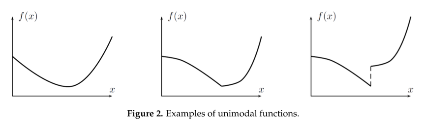
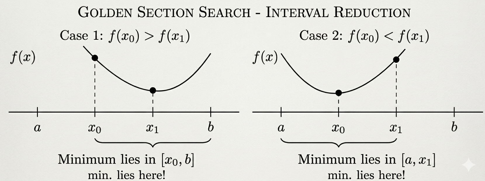
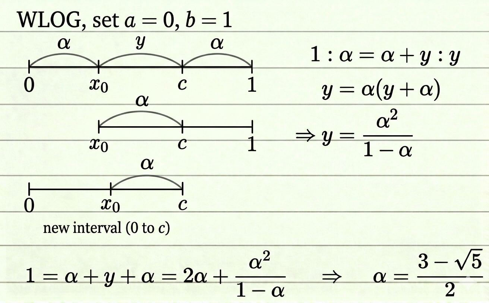
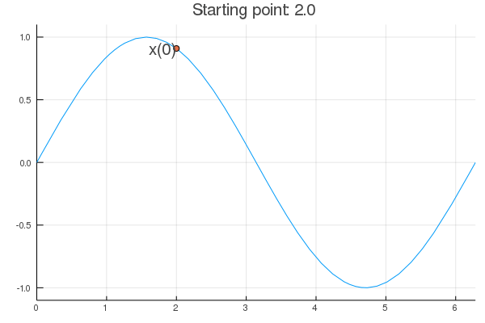
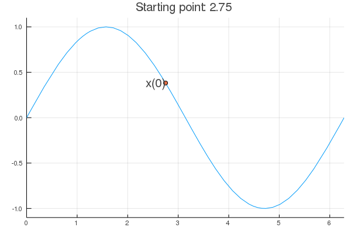
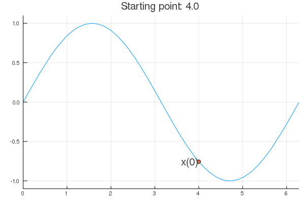
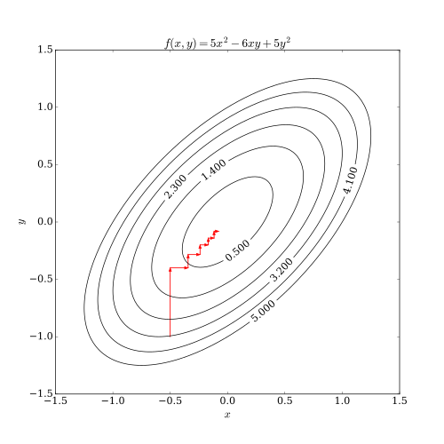
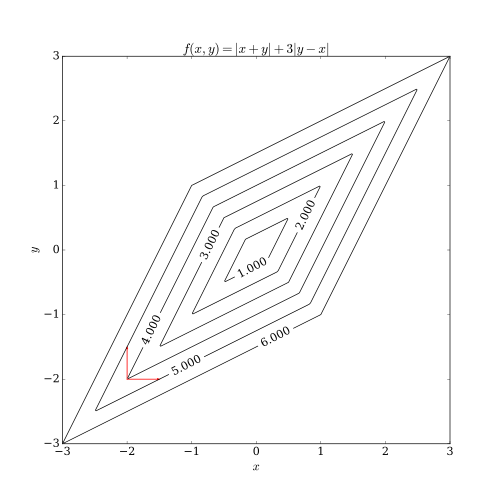

<!-- Requires 'collapse-output' quarto package: https://github.com/mcanouil/    quarto-collapse-output -->

```{r}
#| output-fold: true
#| jupyter: {outputs_hidden: true}
sessionInfo()
```


### Unconstrained optimization 

* Problem
$$
\min_{\mathbf{x}\in \mathbb{R}^d} f(\mathbf{x})
$$

* Maximization: $\min_{\mathbf{x}\in\mathbb{R}^d} -f(\mathbf{x})$


## Golden section search

* $d=1$.

* Applicable to functions defined on an interval of the real line.

* Assumption: $f$ is continuous and *strictly unimodal* on the interval
\
{width=600}

    A function $f: [a,b] \to \mathbb{R}$ is strictly unimodal if 
    $$
    f(\lambda x + (1-\lambda) y) < \max\{ f(x), f(y) \},
    \quad
    x, y \in [a, b],~x\neq y, ~\lambda \in (0, 1).
    $$

* Idea: keep track of three points $a < x_1 < b$ such that $f(x_1) < \min\{f(a), f(b)\}$

* Choose a new point $x_0$ such that $x_0$ belongs to the longer of intervals $(a, x_1)$ and $(x_1, b)$.

* WLOG, suppose $a < x_0 < x_1$.
    - If $f(x_0) > f(x_1)$, then the minimum lies in the interval $(x_0, b)$. Hence set $(a, x_1, b) := (x_0, x_1, b)$.
    - Otherwise, the minimum lies in the interval $(a, x_1)$. Hence set $(a, x_1, b) := (a, x_0, x_1)$.        
    
{width=400}


* Above rules do not say how to choose $x_0$. A possibility is to keep the lengths of the two possible candidate intervals the same: $b - x_0 = x_1 - a$, and the relative position of the intermediate points ($x_1$ to $(x_0, b)$; $x_0$ to $(a, x_1)$) the same. 

* Let $\alpha = \frac{x_0 - a}{b - a}$ and $y = \frac{x_1 - x_0}{b -a}$. Then we require $\frac{b - x_1}{b - a} = \alpha$ and
$$
    1:\alpha = y + \alpha : y, 
    \quad
    \alpha + y + \alpha = 1
    .
$$
By solving this equation, we have $\alpha = \frac{3 - \sqrt{5}}{2}$ or $1 - \alpha = \frac{\sqrt{5} - 1}{2}$, the golden section.

{width=500}

```{r}
#| output-fold: true
#| jupyter: {outputs_hidden: true}
#| tags: []
goldensection <- function(f, a, b, tol=1e-6) {
    alpha <- (3 - sqrt(5)) * 0.5
    f
    iter <- 0
    while ( b - a > tol ) {
        x0 <- a + alpha * (b - a)
        x1 <- b - alpha * (b - a)
        print(c(a, x1, b))
        if ( f(x0) > f(x1) ) {
            a <- x0
        } else { # if ( f(x0) < f(x1) ) {
            b <- x1
            x1 <- x0
        } #else {
          #  if ( f(b) < f(a) ) {
          #      a <- x0
          #  } else {
          #      b <- x1
          #      x1 <- x0                
          #  }
        #}
        iter <- iter + 1
    }
    ret <- list(val = (a + b) / 2, iter = iter)
}
```

```{r}
#| output-fold: true
#| jupyter: {outputs_hidden: true}
#| tags: []
# binomial log-likelihood of 7 successes and 3 failures

F <- function(x) { -7 * log(x) - 3 * log(1 - x) }
goldensection(F, 0.01, 0.99, tol=1e-8)
```

Convergence of golden section search is slow but sure to find the global minimum (if the assumptions are met).

## Newton's Method

* First-order optimality condition
$$
\nabla f(\mathbf{x}^\star) = 0.
$$

* Apply Newton-Raphson to $g(\mathbf{x})=\nabla f(\mathbf{x})$.


* Idea: iterative quadratic approximation. 

* Second-order Taylor expansion of the objective function around the current iterate $\mathbf{x}^{(t)}$
$$
	f(\mathbf{x}) \approx f(\mathbf{x}^{(t)}) + \nabla f(\mathbf{x}^{(t)})^T (\mathbf{x} - \mathbf{x}^{(t)}) + \frac {1}{2} (\mathbf{x} - \mathbf{x}^{(t)})^T [\nabla^2 f(\mathbf{x}^{(t)})] (\mathbf{x} - \mathbf{x}^{(t)})
$$
and then minimize the quadratic approximation.

* To maximize the quadratic appriximation function, we equate its gradient to zero
$$
	\nabla f(\mathbf{x}^{(t)}) + [\nabla^2 f(\mathbf{x}^{(t)})] (\mathbf{x} - \mathbf{x}^{(t)}) = \mathbf{0},
$$
which suggests the next iterate
$$
\begin{eqnarray*}
	\mathbf{x}^{(t+1)} &=& \mathbf{x}^{(t)} - [\nabla^2 f(\mathbf{x}^{(t)})]^{-1} \nabla f(\mathbf{x}^{(t)}),
\end{eqnarray*}
$$
a complete analogue of the univariate Newton-Raphson for solving $g(x)=0$.

* Considered the gold standard for its fast (quadratic) convergence: $\mathbf{x}^{(t)} \to \mathbf{x}^{\star}$ and
$$
	\frac{\|\mathbf{x}^{(t+1)} - \mathbf{x}^{\star}\|}{\|\mathbf{x}^{(t)} - \mathbf{x}^{\star}\|^2} \to \text{constant}.
$$
In words, the estimate gets accurate by two decimal digits per iteration.


We call this **naive Newton's method**.

* **Stability issue**: naive Newton's iterate is **not** guaranteed to be a descent algorithm, i.e., that ensures $f(\mathbf{x}^{(t+1)}) \le f(\mathbf{x}^{(t)})$. It's equally happy to head uphill or downhill. Following example shows that the Newton iterate converges to a local maximum, converges to a local minimum, or diverges depending on starting points.

```{r}
#| output-fold: true
#| jupyter: {outputs_hidden: true}
purenewton <- function(f, df, d2f, x0, maxiter=10, tol=1e-6) {
    xold <- x0
    stop <- FALSE
    iter <- 1
    x <- x0
    while ((!stop) && (iter < maxiter)) {
        x <- x - df(x) / d2f(x)
        print(x)
        xdiff <- x - xold
        if (abs(xdiff) < tol) stop <- TRUE 
        xold <- x
        iter <- iter + 1
    }
    return(list(val=x, iter=iter))
}
```

```{r}
#| output-fold: true
#| jupyter: {outputs_hidden: true}
f <- function(x) sin(x)   # objective function
df <- function(x) cos(x)  # gradient
d2f <- function(x) -sin(x) # hessian
```

```{r}
#| output-fold: true
#| jupyter: {outputs_hidden: true}
purenewton(f, df, d2f, 2.0)
```

{width=500}

```{r}
#| output-fold: true
#| jupyter: {outputs_hidden: true}
purenewton(f, df, d2f, 2.75)
```

{width=500}

```{r}
#| output-fold: true
#| jupyter: {outputs_hidden: true}
purenewton(f, df, d2f, 4.0)
```

{width=500}

## Practical Newton

* A remedy for the instability issue:
    1. approximate $\nabla^2 f(\mathbf{x}^{(t)})$ by a positive definite $\mathbf{H}^{(t)}$ (if it's not), **and** 
    2. line search (backtracking) to ensure the descent property.   

* Why insist on a _positive definite_ approximation of Hessian? First define the **Newton direction**:
$$
\Delta \mathbf{x}^{(t)} = [\mathbf{H}^{(t)}]^{-1} \nabla f(\mathbf{x}^{(t)}).
$$
By first-order Taylor expansion,
$$
\begin{align*}
    f(\mathbf{x}^{(t)} + s \Delta \mathbf{x}^{(t)}) - f(\mathbf{x}^{(t)}) 
    &= \nabla f(\mathbf{x}^{(t)})^T s \Delta \mathbf{x}^{(t)} + o(s) \\
    &= - s \cdot \nabla f(\mathbf{x}^{(t)})^T [\mathbf{H}^{(t)}]^{-1} \nabla f(\mathbf{x}^{(t)}) + o(s).
\end{align*}
$$
For $s$ sufficiently small, $f(\mathbf{x}^{(t)} + s \Delta \mathbf{x}^{(t)}) - f(\mathbf{x}^{(t)})$ is strictly negative if $\mathbf{H}^{(t)}$ is positive definite. 
\
The quantity $\{\nabla f(\mathbf{x}^{(t)})^T [\mathbf{H}^{(t)}]^{-1} \nabla f(\mathbf{x}^{(t)})\}^{1/2}$ is termed the **Newton decrement**.

* In summary, a **practical Newton-type algorithm** iterates according to
$$
	\boxed{ \mathbf{x}^{(t+1)} = \mathbf{x}^{(t)} - s [\mathbf{H}^{(t)}]^{-1} \nabla f(\mathbf{x}^{(t)}) 
	= \mathbf{x}^{(t)} + s \Delta \mathbf{x}^{(t)} }
$$
where $\mathbf{H}^{(t)}$ is a positive definite approximation to $\nabla^2 f(\mathbf{x}^{(t)})$ and $s$ is a step size.

* For strictly convex $f$, $\nabla^2 f(\mathbf{x}^{(t)})$ is always positive definite. In this case, the above algorithm is called **damped Newton**. However, *line search* is still needed (at least for a finite number of times) to guarantee convergence.

### Line search

* Line search: compute the Newton direction and search $s$ such that $f(\mathbf{x}^{(t)} + s \Delta \mathbf{x}^{(t)})$ is minimized.

* Note the Newton direction only needs to be calculated once. Cost of line search mainly lies in objective function evaluation.

* Full line search: $s = \arg\min_{\alpha} f(\mathbf{x}^{(t)} + \alpha \Delta \mathbf{x}^{(t)})$. May use golden section search.

* Approximate line search: step-halving ($s=1,1/2,\ldots$), Amijo rule, ...


* Backtracking line search (Armijo rule)
```r
    # Backtracking line search
    # given: descent direction ∆x, x ∈ domf, α ∈ (0,0.5), β ∈ (0,1).
    t <- 1.0
    while (f(x + t * delx) > f(x) + alpha * t * sum(gradf(x) * delx) {
        t <- beta * t
    }
```


> The lower dashed line shows the linear extrapolation of $f$, and the upper dashed line has a slope a factor of α smaller. The backtracking condition is that $f$ lies below the upper dashed line, i.e., $0 \le t \le t_0$.

* How to approximate $\nabla^2 f(\mathbf{x})$? More of an art than science. Often requires problem specific analysis. 

* Taking $\mathbf{H}^{(t)} = \mathbf{I}$ leads to the **gradient descent method** (see below).

## Fisher scoring

* Consider MLE in which $f(\mathbf{x}) = -\ell(\boldsymbol{\theta})$, where $\ell(\boldsymbol{\theta})$ is the log-likelihood of parameter $\boldsymbol{\theta}$.

* **Fisher scoring method**: replace $- \nabla^2 \ell(\boldsymbol{\theta})$ by the expected Fisher information matrix
$$
	\mathbf{I}(\theta) = \mathbf{E}[-\nabla^2\ell(\boldsymbol{\theta})] = \mathbf{E}[\nabla \ell(\boldsymbol{\theta}) \nabla \ell(\boldsymbol{\theta})^T] \succeq \mathbf{0},
$$
which is true under exchangeability of tne expectation and the differentiation (true for most common distributions).

    Therefore we set $\mathbf{H}^{(t)}=\mathbf{I}(\boldsymbol{\theta}^{(t)})$ and obtain the Fisher scoring algorithm: 
$$
	\boxed{ \boldsymbol{\theta}^{(t+1)} = \boldsymbol{\theta}^{(t)} + s [\mathbf{I}(\boldsymbol{\theta}^{(t)})]^{-1} \nabla \ell(\boldsymbol{\theta}^{(t)})}.
$$

* Combined with line search, a descent algorithm can be devised.

### Example: logistic regression

* Binary data: response $y_i \in \{0,1\}$, predictor $\mathbf{x}_i \in \mathbb{R}^{p}$. 

* Model: $y_i \sim \text{Bernoulli}(p_i)$, where
$$
\begin{align*}
	\mathbf{E} (y_i) = p_i &= g^{-1}(\eta_i) = \frac{e^{\eta_i}}{1+ e^{\eta_i}} \quad \text{(mean function, inverse link function)} \\
	\eta_i = \mathbf{x}_i^T \beta &= g(p_i) = \log \left( \frac{p_i}{1-p_i} \right) \quad \text{(logit link function)}.
\end{align*}
$$


* MLE: density
$$
\begin{align*}
	f(y_i|p_i) &= p_i^{y_i} (1-p_i)^{1-y_i} \\
	&= e^{y_i \log p_i + (1-y_i) \log (1-p_i)} \\
	&= \exp\left( y_i \log \frac{p_i}{1-p_i} + \log (1-p_i)\right).
\end{align*}
$$


* Log likelihood of the data $(y_i,\mathbf{x}_i)$, $i=1,\ldots,n$, and its derivatives are
$$
\begin{align*}
	\ell(\beta) &= \sum_{i=1}^n \left[ y_i \log p_i + (1-y_i) \log (1-p_i) \right] \\
	&= \sum_{i=1}^n \left[ y_i \mathbf{x}_i^T \beta - \log (1 + e^{\mathbf{x}_i^T \beta}) \right] \\
	\nabla \ell(\beta) &= \sum_{i=1}^n \left( y_i \mathbf{x}_i - \frac{e^{\mathbf{x}_i^T \beta}}{1+e^{\mathbf{x}_i^T \beta}} \mathbf{x}_i \right) \\
	&= \sum_{i=1}^n (y_i - p_i) \mathbf{x}_i = \mathbf{X}^T (\mathbf{y} - \mathbf{p})	\\
	- \nabla^2\ell(\beta) &= \sum_{i=1}^n p_i(1-p_i) \mathbf{x}_i \mathbf{x}_i^T = \mathbf{X}^T \mathbf{W} \mathbf{X}, \quad
	\text{where } \mathbf{W} &= \text{diag}(w_1,\ldots,w_n), w_i = p_i (1-p_i) \\
	\mathbf{I}(\beta) &= \mathbf{E} [- \nabla^2\ell(\beta)] = \mathbf{X}^T \mathbf{W} \mathbf{X} = - \nabla^2\ell(\beta) \quad \text{!!!}
\end{align*}
$$
   (why the last line?)

* Therefore for this problem **Newton's method == Fisher scoring**: 
$$
\begin{align*}
	\beta^{(t+1)} &= \beta^{(t)} + s[-\nabla^2 \ell(\beta^{(t)})]^{-1} \nabla \ell(\beta^{(t)})	\\
	&= \beta^{(t)} + s(\mathbf{X}^T \mathbf{W}^{(t)} \mathbf{X})^{-1} \mathbf{X}^T (\mathbf{y} - \mathbf{p}^{(t)}) \\
	&= (\mathbf{X}^T \mathbf{W}^{(t)} \mathbf{X})^{-1} \mathbf{X}^T \mathbf{W}^{(t)} \left[ \mathbf{X} \beta^{(t)} + s(\mathbf{W}^{(t)})^{-1} (\mathbf{y} - \mathbf{p}^{(t)}) \right] \\
	&= (\mathbf{X}^T \mathbf{W}^{(t)} \mathbf{X})^{-1} \mathbf{X}^T \mathbf{W}^{(t)} \mathbf{z}^{(t)},
\end{align*}
$$
where 
$$
	\mathbf{z}^{(t)} = \mathbf{X} \beta^{(t)} + s[\mathbf{W}^{(t)}]^{-1} (\mathbf{y} - \mathbf{p}^{(t)})
$$ 
are the working responses. A Newton iteration is equivalent to solving a *weighed* least squares problem 
$$
\min_{\beta} \sum_{i=1}^n w_i (z_i - \mathbf{x}_i^T \beta)^2
$$
for which we know how to solve well.
Thus the name **IRLS (iteratively re-weighted least squares)**.

* Implication: if a weighted least squares solver is at hand, then logistic regression models can be fitted.
    - IRLS == Fisher scoring == Newton's method

### Example: Poisson regression

* Count data: response $y_i \in \{0, 1, 2, \dotsc \}$, predictor $\mathbf{x}_i \in \mathbb{R}^{p}$. 

* Model: $y_i \sim \text{Poisson}(\lambda_i)$, where
$$
\begin{align*}
	\mathbf{E} (y_i) = \lambda_i &= g^{-1}(\eta_i) = e^{\eta_i} \quad \text{(mean function, inverse link function)} \\
	\eta_i = \mathbf{x}_i^T \beta &= g(p_i) = \log \lambda_i  \quad \text{(logit link function)}.
\end{align*}
$$


* MLE: density
$$
\begin{align*}
	f(y_i|\lambda_i) &= e^{-\lambda_i}\frac{\lambda_i^{y_i}}{y_i!} \\
	&= \exp\left( y_i \log \lambda_i - \lambda_i - \log(y_i!) \right)
\end{align*}
$$


* Log likelihood of the data $(y_i,\mathbf{x}_i)$, $i=1,\ldots,n$, and its derivatives are
$$
\begin{align*}
	\ell(\beta) &= \sum_{i=1}^n \left[ y_i \log \lambda_i - \lambda_i - \log(y_i!) \right] \\
	&= \sum_{i=1}^n \left[ y_i \mathbf{x}_i^T \beta - \exp(\mathbf{x}_i^T \beta) - \log(y_i!) \right] \\
	\nabla \ell(\beta) &= \sum_{i=1}^n \left( y_i \mathbf{x}_i - \exp(\mathbf{x}_i^T \beta)\mathbf{x}_i \right) \\
	&= \sum_{i=1}^n (y_i - \lambda_i) \mathbf{x}_i = \mathbf{X}^T (\mathbf{y} - \boldsymbol{\lambda})	\\
	- \nabla^2\ell(\beta) &= \sum_{i=1}^n \lambda_i \mathbf{x}_i \mathbf{x}_i^T = \mathbf{X}^T \mathbf{W} \mathbf{X}, \quad
	\text{where } \mathbf{W} = \text{diag}(\lambda_1,\ldots,\lambda_n) \\
	\mathbf{I}(\beta) &= \mathbf{E} [- \nabla^2\ell(\beta)] = \mathbf{X}^T \mathbf{W} \mathbf{X} = - \nabla^2\ell(\beta) \quad \text{!!!}
\end{align*}
$$
   (why the last line?)

* Therefore for this problem **Newton's method == Fisher scoring**: 
$$
\begin{align*}
	\beta^{(t+1)} &= \beta^{(t)} + s[-\nabla^2 \ell(\beta^{(t)})]^{-1} \nabla \ell(\beta^{(t)})	\\
	&= \beta^{(t)} + s(\mathbf{X}^T \mathbf{W}^{(t)} \mathbf{X})^{-1} \mathbf{X}^T (\mathbf{y} - \boldsymbol{\lambda}^{(t)}) \\
	&= (\mathbf{X}^T \mathbf{W}^{(t)} \mathbf{X})^{-1} \mathbf{X}^T \mathbf{W}^{(t)} \left[ \mathbf{X} \beta^{(t)} + s(\mathbf{W}^{(t)})^{-1} (\mathbf{y} - \boldsymbol{\lambda}^{(t)}) \right] \\
	&= (\mathbf{X}^T \mathbf{W}^{(t)} \mathbf{X})^{-1} \mathbf{X}^T \mathbf{W}^{(t)} \mathbf{z}^{(t)},
\end{align*}
$$
where 
$$
	\mathbf{z}^{(t)} = \mathbf{X} \beta^{(t)} + s[\mathbf{W}^{(t)}]^{-1} (\mathbf{y} - \boldsymbol{\lambda}^{(t)})
$$ 
are the working responses. A Newton iteration is again equivalent to solving a *weighed* least squares problem 
$$
\min_{\beta} \sum_{i=1}^n w_i (z_i - \mathbf{x}_i^T \beta)^2
$$
which leads to the IRLS.

* Implication: if a weighted least squares solver is at hand, then Poisson regression models can be fitted.
    - IRLS == Fisher scoring == Newton's method

```{r}
#| output-fold: true
#| jupyter: {outputs_hidden: true}
# Quarterly count of AIDS deaths in Australia (from Dobson, 1990)
deaths <- c(0, 1, 2, 3, 1, 4, 9, 18, 23, 31, 20, 25, 37, 45)
(quarters <- seq_along(deaths))
```

```{r}
#| output-fold: true
#| jupyter: {outputs_hidden: true}
# Poisson regression using Fisher scoring (IRLS) and step halving
# Model: lambda = exp(beta0 + beta1 * quarter), or deaths ~ quarter
poissonreg <- function(x, y, maxiter=10, tol=1e-6) {
    beta0 <- matrix(0, nrow=2, ncol=1)   # initial point
    betaold <- beta0
    stop <- FALSE
    iter <- 1
    inneriter <- rep(0, maxiter)  # to count no. step halving
    beta <- beta0
    lik <- function(bet) {eta <- bet[1] + bet[2] * x; sum( y * eta - exp(eta) ) } # log-likelihood
    likold <- lik(betaold)
    while ((!stop) && (iter < maxiter)) {
        eta <- beta[1] + x * beta[2]
        w <- exp(eta)  # lambda
        # line search by step halving
        s <- 1.0
        for (i in 1:5) {
            z <- eta + s * (y / w - 1) # working response
            m <- lm(z ~ x, weights=w)  # weighted least squares
            beta <- as.matrix(coef(m))
            curlik <- lik(beta)
            if (curlik > likold) break
            s <- s * 0.5
            inneriter[iter] <- inneriter[iter] + 1
        }
        print(c(as.numeric(beta), inneriter[iter], curlik))
        betadiff <- beta - betaold
        if (norm(betadiff, "F") < tol) stop <- TRUE 
        likold <- curlik
        betaold <- beta
        iter <- iter + 1
    }
    return(list(val=as.numeric(beta), iter=iter, inneriter=inneriter[1:iter]))
}
```

```{r}
#| output-fold: true
#| jupyter: {outputs_hidden: true}
poissonreg(quarters, deaths)
```

```{r}
#| output-fold: true
#| jupyter: {outputs_hidden: true}
m <- glm(deaths ~ quarters, family = poisson())
coef(m)
```

*Homework: repeat this using the Armijo rule.*

### Generalized Linear Models (GLM)

That IRLS == Fisher scoring == Newton's method for both logistic and Poisson regression is not a coincidence.  Let's consider a more general class of generalized linear models (GLM).

#### Exponential families

* Random variable $Y$ belongs to an exponential family if the density
$$
	p(y|\eta,\phi) = \exp \left\{ \frac{y\eta - b(\eta)}{a(\phi)} + c(y,\phi) \right\}.
$$
    * $\eta$: natural parameter.  
    * $\phi>0$: dispersion parameter.  
    * Mean: $\mu= b'(\eta)$. When $b'(\cdot)$ is invertible, function $g(\cdot)=[b']^{-1}(\cdot)$ is called the canonical link function.
    * Variance $\mathbf{Var}{Y}=b''(\eta)a(\phi)$.


* For example, if $Y \sim \text{Ber}(\mu)$, then
$$
p(y|\eta,\phi) = \exp\left( y \log \frac{\mu}{1-\mu} + \log (1-\mu)\right).
$$
Hence
$$
\eta = \log \frac{\mu}{1-\mu}, \quad
\mu = \frac{e^{\eta}}{1+e^{\eta}},
\quad
b(\eta) = -\log (1-\mu) = \log(1+e^{\eta})
$$
Hence
$$
b'(\eta) = \frac{e^{\eta}}{1+e^{\eta}} = g^{-1}(\eta).
$$
as above.


| Family           | Canonical Link                                 | Variance Function |
|------------------|------------------------------------------------|-------------------|
| Normal (unit variance)           | $\eta=\mu$                                     | 1                 |
| Poisson          | $\eta=\log \mu$                                | $\mu$             |
| Binomial         | $\eta=\log \left(\frac{\mu}{1 - \mu} \right)$  | $\mu (1 - \mu)$   |
| Gamma            | $\eta = \mu^{-1}$                              | $\mu^2$           |
| Inverse Gaussian | $\eta = \mu^{-2}$                              | $\mu^3$           |

#### Generalized linear models

GLM models the conditional distribution of $Y$ given predictors $\mathbf{x}$ through
the conditional mean $\mu = \mathbf{E}(Y|\mathbf{x})$ via a strictly increasing link function
$$
	g(\mu) = \mathbf{x}^T \beta, \quad \mu = g^{-1}(\mathbf{x}^T\beta) = b'(\eta)
$$

From these relations we have (assuming no overdispersion, i.e., $a(\phi)\equiv 1$)
$$
\mathbf{x}^T d\beta = g'(\mu)d\mu,
\quad
d\mu = b''(\eta)d\eta, 
\quad
b''(\eta) = \mathbf{Var}[Y] = \sigma^2,
\quad
d\eta = \frac{1}{b''(\eta)}d\mu = \frac{1}{b''(\eta)g'(\mu)}\mathbf{x}^T d\beta.
$$
Therefore
$$
    d\mu = \frac{1}{g'(\mu)}\mathbf{x}^T d\beta
    .
$$

Then, after some workout with matrix calculus, we have for $n$ samples:

* Score, Hessian, information
$$
\begin{align*}
 	\nabla\ell(\beta) &= \sum_{i=1}^n \frac{(y_i-\mu_i) [1/g'(\mu_i)]}{\sigma_i^2} \mathbf{x}_i, \quad \mu_i = g^{-1}(\mathbf{x}_i^T\beta), ~\sigma_i^2 = b''(\eta_i), \\
	- \nabla^2 \ell(\beta) &= \sum_{i=1}^n \frac{[1/g'(\mu_i)]^2}{\sigma_i^2} \mathbf{x}_i \mathbf{x}_i^T - \sum_{i=1}^n \frac{(y_i - \mu_i)[b'''(\eta_i)/[b''(\eta_i)(g'(\mu_i)^2] - g''(\mu_i)/[g'(\mu_i)]^3]}{\sigma^2} \mathbf{x}_i \mathbf{x}_i^T, \\
	\mathbf{I}(\beta) &= \mathbf{E} [- \nabla^2 \ell(\beta)] = \sum_{i=1}^n \frac{[1/g'(\mu_i)]^2}{\sigma_i^2} \mathbf{x}_i \mathbf{x}_i^T = \mathbf{X}^T \mathbf{W} \mathbf{X}.
\end{align*}    
$$


* Fisher scoring method:
$$
 	\beta^{(t+1)} = \beta^{(t)} + s [\mathbf{I}(\beta^{(t)})]^{-1} \nabla \ell(\beta^{(t)})
$$
IRLS with weights $w_i = [1/g'(\mu_i)]^2/\sigma_i^2$ and some working responses $z_i$.

* For *canonical link*, $\mathbf{x}^T\beta = g(\mu) =[b']^{-1}(\mu) = \eta$. The second term of Hessian vanishes because $d\eta=\mathbf{x}^Td\beta$ and $b''(\eta)=1/g'(\mu)$. The Hessian coincides with Fisher information matrix. **IRLS == Fisher scoring == Newton's method**. Hence MLE is a *convex* optimization problem.

 
* Non-canonical link, **Fisher scoring != Newton's method**, and MLE is in general a *non-convex* optimization problem.

  Example: Probit regression (binary response with probit link).
\begin{eqnarray*}
    y_i &\sim& \text{Ber}(p_i) \\
    p_i &=& \Phi(\mathbf{x}_i^T \beta)  \\
    \eta_i &=& \log\left(\frac{p_i}{1-p_i}\right) \neq \mathbf{x}_i^T \beta = \Phi^{-1}(p_i).
\end{eqnarray*}
  where $\Phi(\cdot)$ is the cdf of a standard normal. Exceptionally, this problem is a convex optimization problem.
 
* R implements the Fisher scoring method, aka IRLS, for GLMs in function `glm()`.

## Nonlinear regression - Gauss-Newton method

* Now we finally get to the problem Gauss faced in 1801!  
Relocate the dwarf planet Ceres <https://en.wikipedia.org/wiki/Ceres_(dwarf_planet)> by fitting 24 observations to a 6-parameter (nonlinear) orbit.
    - In 1801, Jan 1 -- Feb 11 (41 days), astronomer Piazzi discovered Ceres, which was lost behind the Sun after observing its orbit 24 times.
    - Aug -- Sep, futile search by top astronomers; Laplace claimed it unsolvable.
    - Oct -- Nov, Gauss did calculations by method of least squares, sent his results to astronomer von Zach.
    - Dec 31, von Zach relocated Ceres according to Gauss’ calculation.

* Nonlinear least squares (curve fitting): 
$$
	\text{minimize} \,\, f(\beta) = \frac{1}{2} \sum_{i=1}^n [y_i - \mu_i(\mathbf{x}_i, \beta)]^2
$$
For example, $y_i =$ dry weight of onion and $x_i=$ growth time, and we want to fit a 3-parameter growth curve
$$
	\mu(x, \beta_1,\beta_2,\beta_3) = \frac{\beta_3}{1 + \exp(-\beta_1 - \beta_2 x)}.
$$


* If $\mu_i$ is a linear function of $\beta$, i.e., $\mathbf{x}_i^T\beta$, then NLLS reduces to the usual least squares.

* "Score" and "information matrices"
$$
\begin{eqnarray*}
	\nabla f(\beta) &=& - \sum_{i=1}^n [y_i - \mu_i(\mathbf{x}_i,\beta)] \nabla \mu_i(\mathbf{x}_i,\beta) \\
	\nabla^2 f(\beta) &=& \sum_{i=1}^n \nabla \mu_i(\mathbf{x}_i,\beta) \nabla \mu_i(\mathbf{x}_i,\beta)^T - \sum_{i=1}^n [y_i - \mu_i(\mathbf{x}_i,\beta)] \nabla^2 \mu_i(\mathbf{x}_i,\beta) \\
	\mathbf{I}(\beta) &=& \sum_{i=1}^n \nabla \mu_i(\mathbf{x}_i,\beta) \nabla \mu_i(\mathbf{x}_i,\beta)^T = \mathbf{J}(\beta)^T \mathbf{J}(\beta),
\end{eqnarray*}
$$
where $\mathbf{J}(\beta)^T = [\nabla \mu_1(\mathbf{x}_1,\beta), \ldots, \nabla \mu_n(\mathbf{x}_n,\beta)] \in \mathbb{R}^{p \times n}$.

* **Gauss-Newton** (= "Fisher scoring method") uses $\mathbf{I}(\beta)$, which is always positive semidefinite.
$$
	\boxed{ \beta^{(t+1)} = \beta^{(t)} - s [\mathbf{I} (\beta^{(t)})]^{-1} \nabla f(\beta^{(t)}) }
$$

* Justification
    1. Residuals $y_i - \mu_i(\mathbf{x}_i, \beta)$ are small, or $\mu_i$ is nearly linear;
    2. Model the data as $y_i \sim N(\mu_i(\mathbf{x}_i, \beta), \sigma^2)$, where $\sigma^2$ is assumed to be known. Then, 
\begin{align*}
        \ell(\beta) &= -\frac{1}{2\sigma^2}\sum_{i=1}^n [y_i - \mu_i(\beta)] \nabla \mu_i(\mathbf{x}_i, \beta) \\
        \nabla\ell(\beta) &= -\sum_{i=1}^n \nabla \mu_i(\mathbf{x}_i,\beta) \nabla \mu_i(\mathbf{x}_i,\beta)^T - \sum_{i=1}^n [y_i - \mu_i(\beta)] \nabla^2 \mu_i(\mathbf{x}_i, \beta) \\
        -\nabla^2 \ell(\beta) &= \sum_{i=1}^n \nabla \mu_i(\mathbf{x}_i,\beta) \nabla \mu_i(\mathbf{x}_i,\beta)^T - \sum_{i=1}^n [y_i - \mu_i(\beta)] \nabla^2 \mu_i(\mathbf{x}_i,\beta) \\
\end{align*}
    Thus
    $$
        \mathbf{E}[-\nabla^2 \ell(\beta)] = \sum_{i=1}^n \nabla \mu_i(\beta) \nabla \mu_i(\beta)^T.
    $$
    
* In fact Gauss invented the Gaussian (normal) distribution to justify this method!

## Gradient descent method

* Iteration:
$$
	\boxed{ \mathbf{x}^{(t+1)} = \mathbf{x}^{(t)} - \gamma_t\nabla f(\mathbf{x}^{(t)}) }
$$
for some step size $\gamma_t$. This is a special case of the Netwon-type algorithms with $\mathbf{H}_t = \mathbf{I}$ and $\Delta\mathbf{x} = \nabla f(\mathbf{x}^{(t)})$.

* Idea: iterative linear approximation (first-order Taylor series expansion). 
$$
	f(\mathbf{x}) \approx f(\mathbf{x}^{(t)}) + \nabla f(\mathbf{x}^{(t)})^T (\mathbf{x} - \mathbf{x}^{(t)})
$$
and then minimize the linear approximation within a compact set: let $\Delta\mathbf{x} = \mathbf{x}^{(t+1)}-\mathbf{x}^{(t)}$ to choose. Solve
$$
    \min_{\|\Delta\mathbf{x}\|_2 \le 1} \nabla f(\mathbf{x}^{(t)})^T\Delta\mathbf{x}
$$
to obtain $\Delta\mathbf{x} = -\nabla f(\mathbf{x}^{(t)})/\|\nabla f(\mathbf{x}^{(t)})\|_2 \propto -\nabla f(\mathbf{x}^{(t)})$.


* Step sizes are chosen so that the descent property is maintained (e.g., line search).
    - Step size *must* be chosen at any time, since unlike Netwon's method, first-order approximation is always unbounded below.

* Pros
    - Each iteration is inexpensive.
    - No need to derive, compute, store and invert Hessians; attractive in large scale problems. 
    
* Cons
    - Slow convergence (zigzagging).

    
    
    - Does not work for non-smooth problems.

### Convergence

* If 
    1. $f$ is convex and differentiable over $\mathbb{R}^d$;
    2. $f$ has $L$-Lipschitz gradients, i.e., $\|\nabla f(\mathbf{x}) - \nabla f(\mathbf{y})\|_2 \le L\|\mathbf{x} - \mathbf{y} \|_2$;
    3. $p^{\star} = \inf_{\mathbf{x}\in\mathbb{R}^d} f(x) > -\infty$ and attained at $\mathbf{x}^{\star}$,
    
   then 
$$
    f(\mathbf{x}^{(t)}) - p^{\star} \le \frac{1}{2\gamma t}\|\mathbf{x}^{(0)} - \mathbf{x}^{\star}\|_2^2 = O(1/t).
$$
    for constant step size ($\gamma_t = \gamma \in (0, 1/L]$), a *sublinear* convergence. Similar upper bound with line search.

* In general, the best we can obtain from gradient descent is linear convergence (cf. quadratic convergence of Newton).

### Examples

* Least squares: $f(\beta) = \frac{1}{2}\|\mathbf{X}\beta - \mathbf{y}\|_2^2 = \frac{1}{2}\beta^T\mathbf{X}^T\mathbf{X}\beta - \beta^T\mathbf{X}^T\mathbf{y} + \frac{1}{2}\mathbf{y}^T\mathbf{y}$

    - Gradient $\nabla f(\beta) = \mathbf{X}^T\mathbf{X}\beta - \mathbf{X}^T\mathbf{y}$ is $\|\mathbf{X}^T\mathbf{X}\|_2$-Lipschitz. Hence $\gamma \in (0, 1/\sigma_{\max}(\mathbf{X})^2]$ guarantees descent property and convergence.

* Logistic regression: $f(\beta) = -\sum_{i=1}^n \left[ y_i \mathbf{x}_i^T \beta - \log (1 + e^{\mathbf{x}_i^T \beta}) \right]$

    - Gradient $\nabla f(\beta) = - \mathbf{X}^T (\mathbf{y} - \mathbf{p})$ is $\frac{1}{4}\|\mathbf{X}^T\mathbf{X}\|_2$-Lipschitz.

    - May be unbounded below, e.g., all the data are of the same class.

    - Adding a ridge penalty $\frac{\rho}{2}\|\beta\|_2^2$ makes the problem identifiable.
    
* Poisson regression: $f(\beta) = -\sum_{i=1}^n \left[ y_i \mathbf{x}_i^T \beta - \exp(\mathbf{x}_i^T \beta) - \log(y_i!) \right]$
    - Gradient
\begin{eqnarray*}
	\nabla f(\beta) &=& -\sum_{i=1}^n \left( y_i \mathbf{x}_i - \exp(\mathbf{x}_i^T \beta)\mathbf{x}_i \right) \\
	&=& -\sum_{i=1}^n (y_i - \lambda_i) \mathbf{x}_i = -\mathbf{X}^T (\mathbf{y} - \boldsymbol{\lambda})
\end{eqnarray*}
    is *not* Lipschitz (HW). What is the consequence?

```{r}
#| output-fold: true
#| jupyter: {outputs_hidden: true}
# Poisson regression using gradient descent
# Model: lambda = exp(beta0 + beta1 * quarter), or deaths ~ quarter
poissonreg_grad <- function(x, y, maxiter=10, tol=1e-6) {
    beta0 <- matrix(0, nrow=2, ncol=1)   # initial point
    betaold <- beta0
    iter <- 1
    inneriter <- rep(0, maxiter)  # to count no. step halving
    betamat <- matrix(NA, nrow=maxiter, ncol=length(beta0) + 2)
    colnames(betamat) <- c("beta0", "beta1", "inneriter", "lik")
    beta <- beta0
    lik <- function(bet) {eta <- bet[1] + bet[2] * x; sum( y * eta - exp(eta) ) } # log-likelihood
    likold <- lik(betaold)
    while (iter < maxiter) {
        eta <- beta[1] + x * beta[2]
        lam <- exp(eta)  # lambda
        grad <- as.matrix(c(sum(lam - y), sum((lam - y) * x)))
        # line search by step halving
        #s <- 0.00001
        s <- 0.00005
        for (i in 1:5) {
            beta <- beta - s * grad
            curlik <- lik(beta)
            if (curlik > likold) break
            s <- s * 0.5
            inneriter[iter] <- inneriter[iter] + 1
        }
        #print(c(as.numeric(beta), inneriter[iter], curlik))
        betamat[iter,] <- c(as.numeric(beta), inneriter[iter], curlik)
        betadiff <- beta - betaold
        if (norm(betadiff, "F") < tol) break
        likold <- curlik
        betaold <- beta
        iter <- iter + 1
    }
    #return(list(val=as.numeric(beta), iter=iter, inneriter=inneriter[1:iter]))
    return(betamat[1:iter,])
}
```

```{r}
#| output-fold: true
#| jupyter: {outputs_hidden: true}
# Australian AIDS data from the IRLS example above
pm <- poissonreg_grad(quarters, deaths, tol=1e-8, maxiter=20000)
head(pm, 10)
tail(pm, 10)
```

Recall

```{r}
#| output-fold: true
#| jupyter: {outputs_hidden: true}
m <- glm(deaths ~ quarters, family = poisson())
coef(m)
```

## Coordinate descent

* Idea: coordinate-wise minimization is often easier than the full-dimensional minimization
$$
    x_j^{(t+1)} = \arg\min_{x_j} f(x_1^{(t+1)}, \dotsc, x_{j-1}^{(t+1)}, x_j, x_{j+1}^{(t)}, \dotsc, x_d^{(t)})
$$



* Similar to the Gauss-Seidel method for solving linear equations. 

* *Block descent*: a vector version of coordinate descent
$$
    \mathbf{x}_j^{(t+1)} = \arg\min_{\mathbf{x}_j} f(\mathbf{x}_1^{(t+1)}, \dotsc, \mathbf{x}_{j-1}^{(t+1)}, \mathbf{x}_j, \mathbf{x}_{j+1}^{(t)}, \dotsc, \mathbf{x}_d^{(t)})
$$

* Q: why objective value converges?
    - A: descent property

* Caution: even if the objective function is convex, coordinate descent may *not* converge to the global minimum and converge to a suboptimal point.



